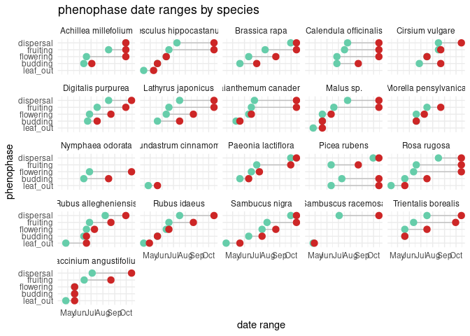
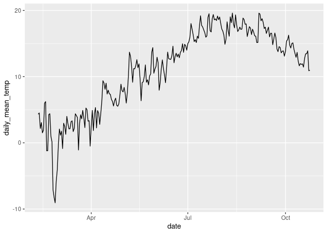
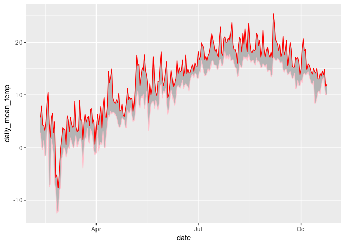

Project analysis
================
Rat Bastards

``` r
library(tidyverse)
library(broom)
library(readr)
library(dplyr)
library(forcats)
library(lubridate)
```

``` r
# hurricane_plants <- read_csv("../data/hurricane_plants.csv")

hurricane_plants <- read_csv("../data/hurricane_plants.csv", 
    col_types = cols(date = col_date(format = "%m/%d/%Y")))
```

    ## Warning: One or more parsing issues, call `problems()` on your data frame for details,
    ## e.g.:
    ##   dat <- vroom(...)
    ##   problems(dat)

``` r
weather_data <- read_csv("../data/neracoos_buoy_data.csv")
```

``` r
# arrange variables in logical order
hurricane_plants <- relocate(hurricane_plants, 
       date, 
       life_form, 
       species, 
       initial_emergence,
       breaking_leaf_buds_count,
       leaf_presence,
       percent_unfolded_leaves,
       unfolded_leaves_count,
       percent_full_size_leaf,
       percent_leaves_colorful,
       fallen_leaf_presence,
       breaking_needle_bud_count,
       young_needle_count,
       percent_stalk_growth,
       percent_fiddlehead_unrolled,
       buds_and_flowers_count,
       percent_open_flowers,
       pollen_amount,
       pollen_cone_count,
       percent_open_pollen_cones,
       fruit_count,
       unripe_seed_cone_count, 
       percent_ripe_fruits,
       ripe_seed_cone_count,
       dropped_fruit_count,
       notes
       )

# remove empty rows, where life_form is NA 
hurricane_plants <- hurricane_plants %>% 
  filter(!is.na(life_form))
```

``` r
# new variable of a string of numbers for observed phases
# 1 = leafing out
# 2 = budding
# 3 = flowering
# 4 = fruiting
# 5 = ripe fruits/seeds
# 6 = seed dispersal
# hurricane_plants <- hurricane_plants %>%
#   mutate(phenophase = case_when(
#     initial_emergence == T        ~ "1",
#     buds_and_flowers_count > 0    ~ "2",
#     pollen_cone_count > 0         ~ "2",
#     percent_open_flowers > 0      ~ "3",
#     pollen_amount != "none"       ~ "3",
#     fruit_count > 0               ~ "4"))

# first emergence column creation
hurricane_plants_join <- hurricane_plants %>%
  # mutate(date = as.Date(date)) %>%
  group_by(species, initial_emergence) %>% 
  filter(date == min(date)) %>% 
  slice(1) %>% # takes the first occurrence if there is a tie
  ungroup() %>%
  filter(initial_emergence == "TRUE") %>%
  dplyr::select(date, species, first_emergence=initial_emergence)

hurricane_plants <- hurricane_plants %>%
  full_join(hurricane_plants_join, join_by(date, species))
```

``` r
# create leafing out phenophase
hurricane_plants <- hurricane_plants %>%
  mutate(leaf_out = case_when(
    breaking_leaf_buds_count > 0 & percent_unfolded_leaves < 1 ~ T,
    percent_unfolded_leaves > 0 & percent_unfolded_leaves < 1 ~ T,
    breaking_needle_bud_count > 0 ~ T,
    percent_stalk_growth > 0 & percent_stalk_growth < 1 ~ T,
    .default = F
  ))
  
# create budding phenophase
hurricane_plants <- hurricane_plants %>%
  mutate(budding = case_when(
    buds_and_flowers_count > 0 & percent_open_flowers < 1 ~ T,
    pollen_cone_count > 0 ~ T,
    .default = F
  ))

# create flowering phenophase
hurricane_plants <- hurricane_plants %>%
  mutate(flowering = case_when(
    percent_open_flowers > 0 & buds_and_flowers_count > 0 ~ T,
    pollen_amount != "none" ~ T,
    .default = F
  ))

# create fruiting phenophase
hurricane_plants <- hurricane_plants %>%
  mutate(fruiting = case_when(
    fruit_count > 0 ~ T,
    unripe_seed_cone_count > 0 ~ T,
    .default = F
  ))

# create dispersal phenophase
hurricane_plants <- hurricane_plants %>%
  mutate(dispersal = case_when(
    percent_ripe_fruits > 0 ~ T,
    ripe_seed_cone_count > 1 ~ T,
    dropped_fruit_count > 0 ~ T,
    .default = F
  ))
```

``` r
# join first emergence to phenophase dataframe
# hurricane_plants <- hurricane_plants %>%
#   full_join(hurricane_plants_join, join_by(species))

# pivot longer
hurricane_plants_long <- hurricane_plants %>%
  pivot_longer(
    cols = c(leaf_out : dispersal), 
    names_to = "phenophase"
  ) %>%
  filter(value == "TRUE") %>%
  group_by(species, phenophase) %>%
  summarize(start_date = min(date), 
            end_date = max(date))
```

    ## `summarise()` has grouped output by 'species'. You can override using the
    ## `.groups` argument.

``` r
# plot
as.data.frame(hurricane_plants_long) %>%
  #fct_relevel(f) 
  # mutate(phenophase = as.character(phenophase)) %>%
  # fct_relevel(phenophase, c("leaf_out", "budding", "flowering", "fruiting", "dispersal")) %>%
ggplot() +
  geom_segment( aes(x=(fct_relevel(phenophase, c("leaf_out", "budding", "flowering", "fruiting", "dispersal"))), xend=(fct_relevel(phenophase, c("leaf_out", "budding", "flowering", "fruiting", "dispersal"))), y=start_date, yend=end_date), color="grey") +
  geom_point(aes(x=(fct_relevel(phenophase, c("leaf_out", "budding", "flowering", "fruiting", "dispersal"))), y=start_date), color=rgb(0.2,0.7,0.1,0.5), size=3 ) +
  geom_point(aes(x=(fct_relevel(phenophase, c("leaf_out", "budding", "flowering", "fruiting", "dispersal"))), y=end_date), color=rgb(0.7,0.2,0.1,0.5), size=3 ) +
  coord_flip()+
  facet_wrap(~ species) +
  theme_minimal() +
  theme(
    legend.position = "none",
  ) +
  labs(x = "phenophase",
       y = "date range",
       title = "phenophase date ranges by species")
```

<!-- -->

``` r
# lubridate weather entries, calculate useful daily temperatures
weather_data <- weather_data %>%
  mutate(time = ymd_hms(time),
         month = month(time),
         day = day(time),
         date = as_date(round_date(time, unit = "day"))) %>%
  mutate(air_temperature = as.numeric(air_temperature)) %>%
  group_by(date) %>%
  summarize(daily_mean_temp = mean(air_temperature, na.rm = TRUE),
            daily_min_temp = min(air_temperature, na.rm = TRUE),
            daily_max_temp = max(air_temperature, na.rm = TRUE),
            daily_sd_temp = sd(air_temperature, na.rm = TRUE))

# glimpse weather data
glimpse(weather_data)
```

    ## Rows: 258
    ## Columns: 5
    ## $ date            <date> 2023-02-10, 2023-02-11, 2023-02-12, 2023-02-13, 2023-…
    ## $ daily_mean_temp <dbl> 4.3199174, 4.5143333, 2.1710903, 3.0611181, 1.5061042,…
    ## $ daily_min_temp  <dbl> 2.844, 0.231, -0.375, 1.288, -1.607, -1.525, 2.950, 4.…
    ## $ daily_max_temp  <dbl> 5.705, 7.941, 4.306, 4.293, 3.260, 4.890, 8.490, 10.52…
    ## $ daily_sd_temp   <dbl> 0.6105609, 1.8303061, 1.2549979, 0.7976728, 1.6090949,…

``` r
# set species minimums for temperatures and calculate total days above "frosts"
weather_data %>%
  group_by(date) %>%
  mutate(yarrow_temp_above = case_when(daily_mean_temp > 5 ~ 1, 
                                       TRUE ~ 0),
         apple_temp_above = case_when(daily_mean_temp > 12 ~ 1, 
                                       TRUE ~ 0)) %>% #find relevant temperatures, name by species, and join to hurricane_plants by this variable (dates after critical period)
  pivot_longer(cols = c(yarrow_temp_above, apple_temp_above), names_to = "species_germ", values_to = "germination_possible") %>%
  filter(germination_possible == 1) %>% #earliest non-frost or favourable germination date
  group_by(species_germ) %>%
  slice_min(date, n = 1)
```

    ## # A tibble: 2 × 7
    ## # Groups:   species_germ [2]
    ##   date       daily_mean_temp daily_min_temp daily_max_temp daily_sd_temp
    ##   <date>               <dbl>          <dbl>          <dbl>         <dbl>
    ## 1 2023-05-07           13.7            9.67          17.5          1.63 
    ## 2 2023-02-16            5.99           2.95           8.49         0.994
    ## # ℹ 2 more variables: species_germ <chr>, germination_possible <dbl>

``` r
# line plot daily mean temperature
ggplot(weather_data, aes(x=date, y=daily_mean_temp)) +
  geom_line() 
```

    ## Warning: Removed 1 row containing missing values (`geom_line()`).

<!-- -->

``` r
# plot ribbon of daily temperature readings
weather_data %>%
  ggplot(aes(x = date)) +
    geom_ribbon(aes(y = daily_mean_temp, ymin = daily_min_temp, ymax = daily_max_temp), alpha = 0.3) +
    geom_line(aes(y = daily_mean_temp), color = "blue") +
    geom_line(aes(y = daily_min_temp), color = "pink") 
```

    ## Warning: Removed 1 row containing missing values (`geom_line()`).
    ## Removed 1 row containing missing values (`geom_line()`).

<!-- -->

``` r
hurricane_climate <- read_file("../data/hurricane_climate.sdb")
```
