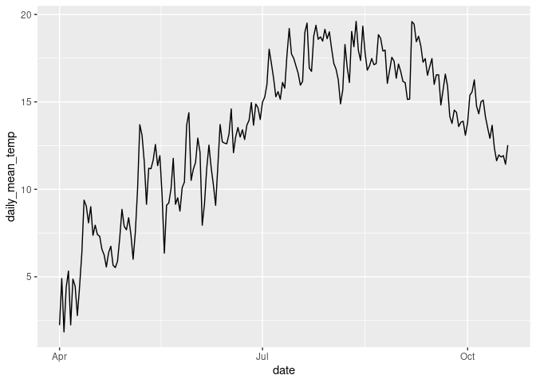
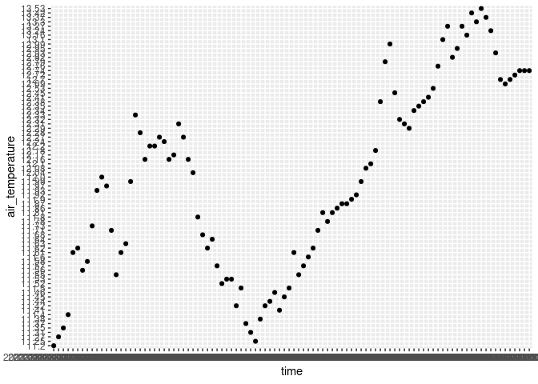

Project analysis
================
Rat Bastards

``` r
library(tidyverse)
library(broom)
library(readr)
library(dplyr)
```

``` r
hurricane_plants <- read_csv("../data/hurricane_plants.csv")

weather_data <- read_csv("../data/neracoos_buoy_data.csv")
```

``` r
hurricane_plants <- relocate(hurricane_plants, 
       date, 
       life_form, 
       species, 
       initial_emergence,
       breaking_leaf_buds_count,
       leaf_presence,
       percent_unfolded_leaves,
       unfolded_leaves_count,
       percent_full_size_leaf,
       percent_leaves_colorful,
       fallen_leaf_presence,
       breaking_needle_bud_count,
       young_needle_count,
       percent_stalk_growth,
       percent_fiddlehead_unrolled,
       buds_and_flowers_count,
       percent_open_flowers,
       pollen_amount,
       pollen_cone_count,
       percent_open_pollen_cones,
       fruit_count,
       unripe_seed_cone_count, 
       percent_ripe_fruits,
       ripe_seed_cone_count,
       dropped_fruit_count,
       notes
       )

# Remove empty rows, where life_form is NA 
hurricane_plants <- hurricane_plants %>% 
  filter(!is.na(life_form))
```

``` r
# rerun above code if error

# lubridate weather entries, calculate useful daily temperatures
weather_data <- weather_data %>%
  mutate(time = ymd_hms(time),
         month = month(time),
         day = day(time),
         date = as_date(round_date(time, unit = "day"))) %>%
  mutate(air_temperature = as.numeric(air_temperature)) %>%
  group_by(date) %>%
  summarize(daily_mean_temp = mean(air_temperature, na.rm = TRUE),
            daily_min_temp = min(air_temperature, na.rm = TRUE),
            daily_max_temp = max(air_temperature, na.rm = TRUE),
            daily_sd_temp = sd(air_temperature, na.rm = TRUE))
```

    ## Warning: There was 1 warning in `mutate()`.
    ## ℹ In argument: `time = ymd_hms(time)`.
    ## Caused by warning:
    ## !  1 failed to parse.

    ## Warning: There was 1 warning in `mutate()`.
    ## ℹ In argument: `air_temperature = as.numeric(air_temperature)`.
    ## Caused by warning:
    ## ! NAs introduced by coercion

    ## Warning: There were 2 warnings in `summarize()`.
    ## The first warning was:
    ## ℹ In argument: `daily_min_temp = min(air_temperature, na.rm = TRUE)`.
    ## ℹ In group 258: `date = NA`.
    ## Caused by warning in `min()`:
    ## ! no non-missing arguments to min; returning Inf
    ## ℹ Run `dplyr::last_dplyr_warnings()` to see the 1 remaining warning.

``` r
# set species minimums for tempuratures and calculate totaldays above "frosts"
weather_data %>%
  group_by(date) %>%
  mutate(yarrow_temp_above = case_when(daily_mean_temp > 10 ~ 1, 
                                       TRUE ~ 0),
         apple_temp_above = case_when(daily_mean_temp > 12 ~ 1, 
                                       TRUE ~ 0)) %>% #find relevant temperatures, name by species, and join to hurricane_plants by this variable (dates after critical period)
  pivot_longer(cols = c(yarrow_temp_above, apple_temp_above), names_to = "species_germ", values_to = "germination_possible") %>%
  filter(germination_possible == 1) %>% #earliest non-frost or favourable germination date
  group_by(species_germ) %>%
  slice_min(date, n = 1)
```

    ## # A tibble: 2 × 7
    ## # Groups:   species_germ [2]
    ##   date       daily_mean_temp daily_min_temp daily_max_temp daily_sd_temp
    ##   <date>               <dbl>          <dbl>          <dbl>         <dbl>
    ## 1 2023-05-07            13.7           9.67           17.5          1.63
    ## 2 2023-05-06            10.0           7.39           13.1          1.21
    ## # ℹ 2 more variables: species_germ <chr>, germination_possible <dbl>

``` r
# line plot daily mean tempurature
ggplot(weather_data, aes(x=date, y=daily_mean_temp)) +
  geom_line() 
```

    ## Warning: Removed 1 row containing missing values (`geom_line()`).

<!-- -->

``` r
# plot ribbon of daily tempurature readings
weather_data %>%
  ggplot(aes(x = date)) +
    geom_ribbon(aes(y = daily_mean_temp, ymin = daily_min_temp, ymax = daily_max_temp), alpha = 0.3) +
    geom_line(aes(y = daily_mean_temp), color = "blue") +
    geom_line(aes(y = daily_min_temp), color = "pink") 
```

    ## Warning: Removed 1 row containing missing values (`geom_line()`).

    ## Warning: Removed 1 row containing missing values (`geom_line()`).

<!-- -->

``` r
#attempting a scatterplot instead. She's messy. Help her. <3

# glimpse weather data
glimpse(weather_data)
```

    ## Rows: 258
    ## Columns: 5
    ## $ date            <date> 2023-02-10, 2023-02-11, 2023-02-12, 2023-02-13, 2023-…
    ## $ daily_mean_temp <dbl> 4.3199174, 4.5143333, 2.1710903, 3.0611181, 1.5061042,…
    ## $ daily_min_temp  <dbl> 2.844, 0.231, -0.375, 1.288, -1.607, -1.525, 2.950, 4.…
    ## $ daily_max_temp  <dbl> 5.705, 7.941, 4.306, 4.293, 3.260, 4.890, 8.490, 10.52…
    ## $ daily_sd_temp   <dbl> 0.6105609, 1.8303061, 1.2549979, 0.7976728, 1.6090949,…
