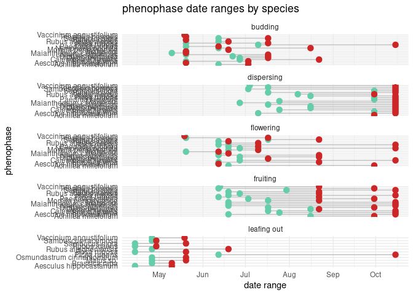
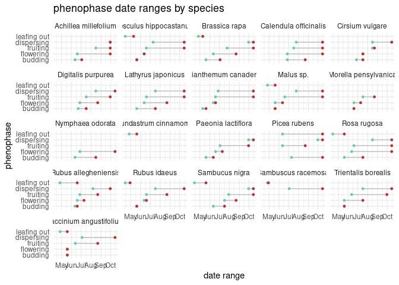
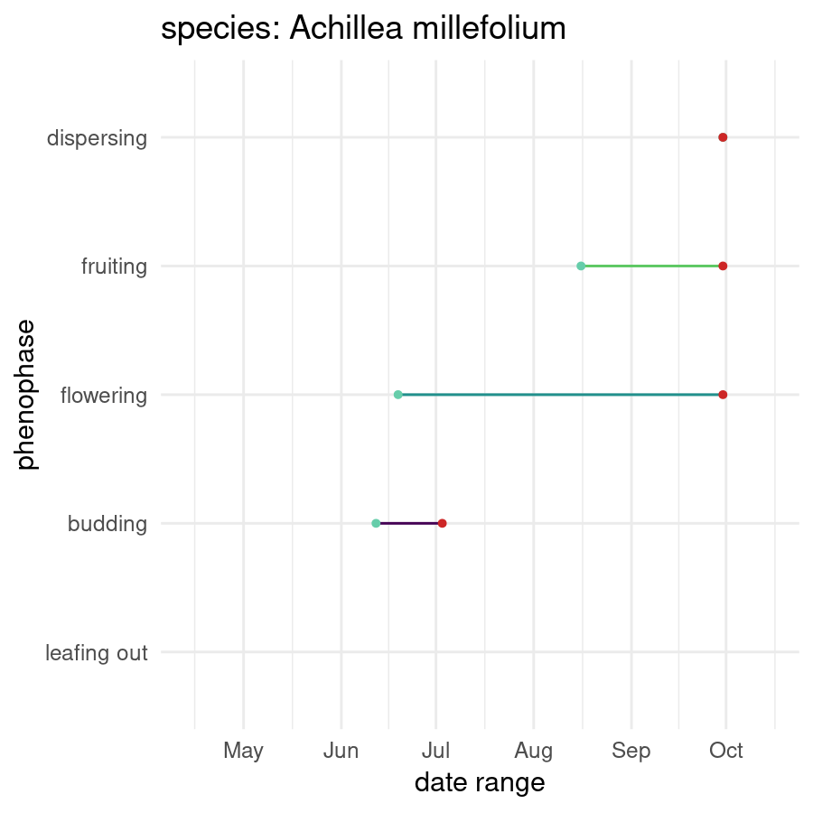

Project analysis
================
Rat Bastards

``` r
 # install.packages("devtools")
 # install.packages("suncalc")  #install these in the console
 # devtools::install_github("datastorm-open/suncalc")
# install.packages("visdat")
# install.packages("naniar")
# install.packages("gganimate")

library(tidyverse)
library(broom)
library(readr)
library(dplyr)
library(forcats)
library(lubridate)
library(devtools)
#library(suncalc)
library(visdat)
library(naniar)                                 
library(gganimate)
```

``` r
# hurricane_plants <- read_csv("../data/hurricane_plants.csv")

hurricane_plants <- read_csv("../data/hurricane_plants.csv", 
    col_types = cols(date = col_date(format = "%m/%d/%Y")))

weather_data <- read_csv("../data/neracoos_buoy_data.csv")
```

``` r
# arrange variables in logical order
hurricane_plants <- relocate(hurricane_plants, 
       date, 
       life_form, 
       species, 
       common_name,
       # angiosperm data
       initial_emergence,
       breaking_leaf_buds_count,
       leaf_presence,
       percent_unfolded_leaves,
       unfolded_leaves_count,
       percent_full_size_leaf,
       percent_leaves_colorful,
       fallen_leaf_presence,
       buds_and_flowers_count,
       percent_open_flowers,
       pollen_amount,
       fruit_count,
       unripe_seed_cone_count, 
       percent_ripe_fruits,
       dropped_fruit_count,
       # fern data
       percent_stalk_growth,
       percent_fiddlehead_unrolled,
       sporangia_presence,
       releasing_spores,
       # gymnosperm data
       breaking_needle_bud_count,
       young_needle_count,
       percent_open_pollen_cones,
       pollen_cone_count,
       ripe_seed_cone_count,
       
       notes
       )

# remove empty rows, where life_form is NA 
hurricane_plants <- hurricane_plants %>% 
  filter(!is.na(life_form))
```

``` r
hurricane_plants %>%
  ggplot(aes(x = fct_infreq(common_name), fill = life_form)) +
  
  geom_bar() +
  coord_flip() +
  labs(title = "amount of observations by species") +
  xlab("") +
  ylab("") +
  scale_fill_viridis_d()
```

<!-- -->

``` r
# show columns with color coded NAs and datatypes
visdat::vis_dat(hurricane_plants)
```

<!-- -->

``` r
# create lolipop graph of NAs by column
naniar::gg_miss_var(hurricane_plants)
```

<!-- -->

``` r
gg_miss_fct(hurricane_plants, fct = common_name)
```

<!-- -->

``` r
# first emergence column creation
hurricane_plants_join <- hurricane_plants %>%
  # mutate(date = as.Date(date)) %>%
  group_by(species, initial_emergence) %>% 
  filter(date == min(date)) %>% 
  slice(1) %>% # takes the first occurrence if there is a tie
  ungroup() %>%
  filter(initial_emergence == "TRUE") %>%
  dplyr::select(date, species, first_emergence=initial_emergence)

hurricane_plants <- hurricane_plants %>%
  full_join(hurricane_plants_join, join_by(date, species))
```

``` r
# create leafing out phenophase
hurricane_plants <- hurricane_plants %>%
  mutate(leaf_out = case_when(
    initial_emergence == T & buds_and_flowers_count == 0 & species %in% c("Brassica rapa") ~ T,
     initial_emergence == T & buds_and_flowers_count > 0 & species %in% c("Brassica rapa") ~ F, # some reason not turning F, HELP!
     # initial_emergence == T & buds_and_flowers_count == 0 & species %in% c("Brassica rapa") & date >  ~ F,
    leaf_presence == T ~ F,
    breaking_leaf_buds_count > 0 & percent_unfolded_leaves < 1 ~ T,
    percent_unfolded_leaves > 0 & percent_unfolded_leaves < 1 ~ T,
    breaking_needle_bud_count > 0 ~ T,
    percent_stalk_growth > 0 & percent_stalk_growth < 1 ~ T,
    .default = F
  ))
  
# create budding phenophase
hurricane_plants <- hurricane_plants %>%
  mutate(budding = case_when(
    buds_and_flowers_count > 0 & percent_open_flowers < 1 ~ T,
    # sporangia_presence == T ~ T,
    pollen_cone_count > 0 ~ T,
    .default = F
  ))

# create flowering phenophase
hurricane_plants <- hurricane_plants %>%
  mutate(flowering = case_when(
    percent_open_flowers > 0 & buds_and_flowers_count > 0 ~ T,
    pollen_amount != "none" ~ T,
    .default = F
  ))

# create fruiting phenophase
hurricane_plants <- hurricane_plants %>%
  mutate(fruiting = case_when(
    fruit_count > 0 ~ T,
    unripe_seed_cone_count > 0 ~ T,
    .default = F
  ))

# create dispersal phenophase
hurricane_plants <- hurricane_plants %>%
  mutate(dispersal = case_when(
    percent_ripe_fruits > 0 ~ T,
    ripe_seed_cone_count > 1 ~ T,
    dropped_fruit_count > 0 ~ T,
    .default = F
  ))

# pivot longer
hurricane_plants_long <- hurricane_plants %>%
  pivot_longer(
    cols = c(leaf_out : dispersal), 
    names_to = "phenophase"
  ) %>%
  filter(value == "TRUE") %>%
  group_by(species, phenophase) %>%
  summarize(start_date = min(date), 
            end_date = max(date))
```

    ## `summarise()` has grouped output by 'species'. You can override using the
    ## `.groups` argument.

``` r
# reformat phenophase labels
hurricane_plants_long <- hurricane_plants_long %>%
  mutate(phenophase = case_when(
    phenophase == "leaf_out"           ~ "leafing out",
    phenophase == "dispersal"          ~ "dispersing",
    TRUE                                           ~ phenophase
  ))
```

``` r
hurricane_plants_long %>%
ggplot() +
  geom_segment(aes(x = species,
                    y = start_date, 
                    xend = species,
                 yend=end_date), 
                color = "grey") +
  
  geom_point(aes(x = species,
                 y = start_date), 
             color = "aquamarine3", 
             size = 3 ) +
  
  geom_point(aes(x = species,
                 y = end_date), 
             color = "firebrick3", 
             size = 3 ) +
  #geom_line(y = min(date)) +
  coord_flip()+
  facet_wrap(~ fct_relevel(phenophase, c("dispersing",
                                                   "fruiting",
                                                   "flowering",
                                                   "budding",
                                                   "leafing out")), 
             scales = "free_y", 
             ncol = 1, strip.position = "left") +
  theme_minimal() +
  theme(legend.position = "none",) +
  labs(x = "phenophase",
       y = "date range",
       title = "phenophase date ranges by species")
```

<!-- -->

``` r
# join first emergence to phenophase dataframe
#hurricane_plants <- hurricane_plants %>%
# full_join(hurricane_plants_join, join_by(species))


# plot
hurricane_plants_long %>%
ggplot() +
  geom_segment( aes(x = (fct_relevel(phenophase, c("leafing out",
                                                   "budding",
                                                   "flowering",
                                                   "fruiting",
                                                   "dispersing"))), 
                    xend = (fct_relevel(phenophase, c("leafing out",
                                                      "budding",
                                                      "flowering",
                                                      "fruiting",
                                                      "dispersing"))),
                    y = start_date, 
                    yend=end_date), 
                color = "grey") +
  
  geom_point(aes(x = (fct_relevel(phenophase, c("leafing out", 
                                                "budding", 
                                                "flowering", 
                                                "fruiting",
                                                "dispersing"))),
                 y = start_date), 
             color = "aquamarine3", 
             size = 3 ) +
  
  geom_point(aes(x = (fct_relevel(phenophase, c("leafing out", 
                                                "budding", 
                                                "flowering", 
                                                "fruiting",
                                                "dispersing"))),
                 y = end_date), 
             color = "firebrick3", 
             size = 3 ) +
  #geom_line(y = min(date)) +
  coord_flip()+
  facet_wrap(~ species) +
  theme_minimal() +
  theme(legend.position = "none",) +
  labs(x = "phenophase",
       y = "date range",
       title = "phenophase date ranges by species")
```

<!-- -->

``` r
hurricane_plants_long %>%
  # filter(species == "Achillea millefolium") %>%
ggplot() +
  geom_segment( aes(x = (fct_relevel(phenophase, c("leaf_out",
                                                   "budding",
                                                   "flowering",
                                                   "fruiting",
                                                   "dispersal"))), 
                    xend = (fct_relevel(phenophase, c("leaf_out",
                                                      "budding",
                                                      "flowering",
                                                      "fruiting",
                                                      "dispersal"))),
                    y = start_date, 
                    yend=end_date), 
                color = "grey") +
  
  geom_point(aes(x = (fct_relevel(phenophase, c("leaf_out", 
                                                "budding", 
                                                "flowering", 
                                                "fruiting",
                                                "dispersal"))),
                 y = start_date), 
             color = "aquamarine3", 
             size = 3 ) +
  
  geom_point(aes(x = (fct_relevel(phenophase, c("leaf_out", 
                                                "budding", 
                                                "flowering", 
                                                "fruiting",
                                                "dispersal"))),
                 y = end_date), 
             color = "firebrick3", 
             size = 3 ) +
  #geom_line(y = min(date)) +
  coord_flip()+
  facet_wrap(~ species) +
  theme_minimal() +
  theme(legend.position = "none",) +
  labs(x = "phenophase",
       y = "date range",
       title = "phenophase date ranges by species")
```

    ## Warning: 2 unknown levels in `f`: leaf_out and dispersal
    ## 2 unknown levels in `f`: leaf_out and dispersal
    ## 2 unknown levels in `f`: leaf_out and dispersal
    ## 2 unknown levels in `f`: leaf_out and dispersal
    ## 2 unknown levels in `f`: leaf_out and dispersal

<!-- -->

``` r
#do breaking leaf buds, buds and flowers, fruit count, dropped fruit count. Just for apple, do it as line

hurricane_plants %>%
  filter(species %in% c("Malus sp.")) %>%
  ggplot(aes(x = date)) +
  geom_line(aes(y = breaking_leaf_buds_count, color = "green")) +
  geom_line(aes(y = buds_and_flowers_count, color = "pink"))+
  geom_line(aes(y = fruit_count, color = "blue"))+
  geom_line(aes(y = dropped_fruit_count, color = "orange"))
```

    ## Warning: Removed 12 rows containing missing values (`geom_line()`).

<!-- -->

``` r
#ask laurie how to make this good and normal
```

``` r
#comparisons with raspberry, blackberry, and blueberry

hurricane_plants %>%
  filter(species %in% c("Rubus allegheniensis", "Vaccinium angustifolium", "Rubus idaeus")) %>%
  filter(!is.na(percent_ripe_fruits)) %>%
  ggplot(aes(x = date, y = percent_ripe_fruits, color = species)) +
  geom_line() +
  labs(title = "Percent ripe fruit coverage over time",
       subtitle = "Coverage in three fruit-bearing individuals in the 2023 season",
       x = "Month",
       y = "Percent of ripe fruit",
       color = "Species") +
  scale_color_viridis_d()
```

<!-- -->

``` r
#Fruit numbers throughout the season
hurricane_plants %>%
  filter(species %in% c("Rubus allegheniensis", "Vaccinium angustifolium", "Rubus idaeus")) %>%
  ggplot(aes(x = date, y = fruit_count, color = species)) +
  geom_line() +
  labs(title = "Fruit count over time",
       subtitle = "Total visible fruits on three individuals in the 2023 season",
       x = "Month",
       y = "Fruit count",
       color = "Species") +
  scale_color_viridis_d()
```

    ## Warning: Removed 7 rows containing missing values (`geom_line()`).

<!-- -->

``` r
#note that the blackberry bush was apparently huge so would have way more fruits than the other two
```

``` r
my_anim <- hurricane_plants_long %>%
ggplot(aes(group = species)) +
  geom_segment( aes(x = (fct_relevel(phenophase, c("leaf_out",
                                                   "budding",
                                                   "flowering",
                                                   "fruiting",
                                                   "dispersal"))), 
                    xend = (fct_relevel(phenophase, c("leaf_out",
                                                      "budding",
                                                      "flowering",
                                                      "fruiting",
                                                      "dispersal"))),
                    y = start_date, 
                    yend=end_date), 
                color = "grey") +
  
  geom_point(aes(x = (fct_relevel(phenophase, c("leaf_out", 
                                                "budding", 
                                                "flowering", 
                                                "fruiting",
                                                "dispersal"))),
                 y = start_date), 
             color = "aquamarine3", 
             size = 3 ) +
  
  
  geom_point(aes(x = (fct_relevel(phenophase, c("leaf_out", 
                                                "budding", 
                                                "flowering", 
                                                "fruiting",
                                                "dispersal"))),
                 y = end_date), 
             color = "firebrick3", 
             size = 3 ) +
  coord_flip() +
  theme_minimal() +
  theme(legend.position = "none",) +
  labs(x = "phenophase",
       y = "date range",
       title = "phenophase date ranges by species") +
  transition_states(states = species)
library(gifski)
animate(my_anim, duration = 20, fps = 20, width = 200, height = 200, renderer = gifski_renderer())
```

    ## Warning: 2 unknown levels in `f`: leaf_out and dispersal
    ## 2 unknown levels in `f`: leaf_out and dispersal
    ## 2 unknown levels in `f`: leaf_out and dispersal
    ## 2 unknown levels in `f`: leaf_out and dispersal
    ## 2 unknown levels in `f`: leaf_out and dispersal

<!-- -->

``` r
anim_save(filename = "lollipop.gif")
```

``` r
# lubridate weather entries, calculate useful daily temperatures
weather_data <- weather_data %>%
  mutate(time = ymd_hms(time),
         month = month(time),
         day = day(time),
         date = as_date(round_date(time, unit = "day"))) %>%
  mutate(air_temperature = as.numeric(air_temperature)) %>%
  group_by(date) %>%
  summarize(daily_mean_temp = mean(air_temperature, na.rm = TRUE),
            daily_min_temp = min(air_temperature, na.rm = TRUE),
            daily_max_temp = max(air_temperature, na.rm = TRUE),
            daily_sd_temp = sd(air_temperature, na.rm = TRUE))

# glimpse weather data
glimpse(weather_data)
```

    ## Rows: 258
    ## Columns: 5
    ## $ date            <date> 2023-02-10, 2023-02-11, 2023-02-12, 2023-02-13, 2023-…
    ## $ daily_mean_temp <dbl> 4.3199174, 4.5143333, 2.1710903, 3.0611181, 1.5061042,…
    ## $ daily_min_temp  <dbl> 2.844, 0.231, -0.375, 1.288, -1.607, -1.525, 2.950, 4.…
    ## $ daily_max_temp  <dbl> 5.705, 7.941, 4.306, 4.293, 3.260, 4.890, 8.490, 10.52…
    ## $ daily_sd_temp   <dbl> 0.6105609, 1.8303061, 1.2549979, 0.7976728, 1.6090949,…

``` r
# set species minimums for temperatures and calculate total days above "frosts"
weather_data %>%
  group_by(date) %>%
  mutate(yarrow_temp_above = case_when(daily_mean_temp > 5 ~ 1, 
                                       TRUE ~ 0),
         apple_temp_above = case_when(daily_mean_temp > 12 ~ 1, 
                                       TRUE ~ 0)) %>% #find relevant temperatures, name by species, and join to hurricane_plants by this variable (dates after critical period)
  pivot_longer(cols = c(yarrow_temp_above, apple_temp_above), names_to = "species_germ", values_to = "germination_possible") %>%
  filter(germination_possible == 1) %>% #earliest non-frost or favourable germination date
  group_by(species_germ) %>%
  slice_min(date, n = 1)
```

    ## # A tibble: 2 × 7
    ## # Groups:   species_germ [2]
    ##   date       daily_mean_temp daily_min_temp daily_max_temp daily_sd_temp
    ##   <date>               <dbl>          <dbl>          <dbl>         <dbl>
    ## 1 2023-05-07           13.7            9.67          17.5          1.63 
    ## 2 2023-02-16            5.99           2.95           8.49         0.994
    ## # ℹ 2 more variables: species_germ <chr>, germination_possible <dbl>

``` r
# line plot daily mean temperature
ggplot(weather_data, aes(x=date, y=daily_mean_temp)) +
  geom_line() 
```

    ## Warning: Removed 1 row containing missing values (`geom_line()`).

<!-- -->

``` r
# plot ribbon of daily temperature readings
weather_data %>%
  ggplot(aes(x = date)) +
    geom_ribbon(aes(y = daily_mean_temp, ymin = daily_min_temp, ymax = daily_max_temp), alpha = 0.3) +
    # geom_line(aes(y = daily_mean_temp), color = "blue") +
    geom_line(aes(y = daily_min_temp), color = "pink") +
    geom_line(aes(y = daily_max_temp), color = "red")
```

    ## Warning: Removed 1 row containing missing values (`geom_line()`).
    ## Removed 1 row containing missing values (`geom_line()`).

<!-- -->

``` r
# #install.packages(leaflet)
library(leaflet) ## For leaflet interactive maps
library(sf) ## For spatial data
```

    ## Linking to GEOS 3.8.0, GDAL 3.0.4, PROJ 6.3.1; sf_use_s2() is TRUE

``` r
# library(htmltools) ## For html
# library(leafsync) ## For placing plots side by side
# library(kableExtra) ## Table output
# library(stringr) ## String manipulation
# install.packages("remotes")
# remotes::install_gitlab("dickoa/rgeoboundaries")
# library(rgeoboundaries) ## Administrative boundaries
# install.packages()
# library(sp)

library(htmltools) ## For html
library(leafsync) ## For placing plots side by side
library(kableExtra) ## Table output
```

    ## 
    ## Attaching package: 'kableExtra'

    ## The following object is masked from 'package:dplyr':
    ## 
    ##     group_rows

``` r
library(stringr) ## String manipulation
#install.packages("remotes")
#remotes::install_gitlab("dickoa/rgeoboundaries")
library(rgeoboundaries) ## Administrative boundaries
```

    ## Registered S3 method overwritten by 'hoardr':
    ##   method           from
    ##   print.cache_info httr

``` r
#install.packages()
library(sp)
```

    ## The legacy packages maptools, rgdal, and rgeos, underpinning the sp package,
    ## which was just loaded, were retired in October 2023.
    ## Please refer to R-spatial evolution reports for details, especially
    ## https://r-spatial.org/r/2023/05/15/evolution4.html.
    ## It may be desirable to make the sf package available;
    ## package maintainers should consider adding sf to Suggests:.

``` r
# install.packages("rgdal")
# library(rgdal)

# read points
plant_points <- read_csv("../data/hurricane_points.csv")
```

    ## Rows: 23 Columns: 5

    ## ── Column specification ────────────────────────────────────────────────────────
    ## Delimiter: ","
    ## chr (1): Plant
    ## dbl (4): FID, Id, x, y
    ## 
    ## ℹ Use `spec()` to retrieve the full column specification for this data.
    ## ℹ Specify the column types or set `show_col_types = FALSE` to quiet this message.

``` r
plant_zones <- read_csv("../data/hurricane_zones.csv")
```

    ## Rows: 5 Columns: 5
    ## ── Column specification ────────────────────────────────────────────────────────
    ## Delimiter: ","
    ## chr (1): Zone
    ## dbl (4): FID, Id, Shape__Area, Shape__Length
    ## 
    ## ℹ Use `spec()` to retrieve the full column specification for this data.
    ## ℹ Specify the column types or set `show_col_types = FALSE` to quiet this message.

``` r
# create map
leaflet(data = plant_points) %>%
   addTiles() %>%
  addProviderTiles(providers$OpenStreetMap) %>%
   setView(lng = -68.895, #<<
           lat = 44.0348, #<<
           zoom = 14.45) %>% #<<
  addCircleMarkers(~x, ~y)
```

    ## QStandardPaths: XDG_RUNTIME_DIR not set, defaulting to '/tmp/runtime-r2229460'
    ## TypeError: Attempting to change the setter of an unconfigurable property.
    ## TypeError: Attempting to change the setter of an unconfigurable property.

<!-- -->
