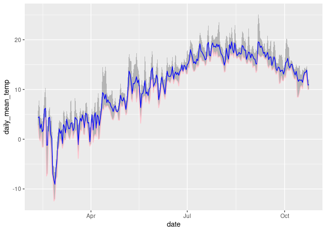

Project analysis
================
Rat Bastards

``` r
library(tidyverse)
library(broom)
library(readr)
library(dplyr)
```

``` r
hurricane_plants <- read_csv("../data/hurricane_plants.csv")

weather_data <- read_csv("../data/neracoos_buoy_data.csv")
```

``` r
hurricane_plants <- relocate(hurricane_plants, 
       date, 
       life_form, 
       species, 
       initial_emergence,
       breaking_leaf_buds_count,
       leaf_presence,
       percent_unfolded_leaves,
       unfolded_leaves_count,
       percent_full_size_leaf,
       percent_leaves_colorful,
       fallen_leaf_presence,
       breaking_needle_bud_count,
       young_needle_count,
       percent_stalk_growth,
       percent_fiddlehead_unrolled,
       buds_and_flowers_count,
       percent_open_flowers,
       pollen_amount,
       pollen_cone_count,
       percent_open_pollen_cones,
       fruit_count,
       unripe_seed_cone_count, 
       percent_ripe_fruits,
       ripe_seed_cone_count,
       dropped_fruit_count,
       notes
       )

# Remove empty rows, where life_form is NA 
hurricane_plants <- hurricane_plants %>% 
  filter(!is.na(life_form))
```

``` r
glimpse(weather_data)
```

    ## Rows: 28,919
    ## Columns: 24
    ## $ station                <chr> NA, "F01", "F01", "F01", "F01", "F01", "F01", "…
    ## $ time                   <chr> "UTC", "2023-04-01T00:00:00Z", "2023-04-01T00:1…
    ## $ mooring_site_desc      <chr> NA, "Penobscot Bay", "Penobscot Bay", "Penobsco…
    ## $ air_temperature        <chr> "celsius", "1.65", "1.638", "1.54", "1.629", "1…
    ## $ air_temperature_qc     <dbl> 1, 0, 0, 0, 0, 0, 0, 0, 0, 0, 0, 0, 0, 0, 0, 0,…
    ## $ barometric_pressure    <chr> "millibars", "1020.7775", "1020.71747", "1020.7…
    ## $ barometric_pressure_qc <dbl> 1, 0, 0, 0, 0, 0, 0, 0, 0, 0, 0, 0, 0, 0, 0, 0,…
    ## $ wind_gust              <chr> "m/s", "10.04", "9.33", "7.683", "7.448", "6.86…
    ## $ wind_gust_qc           <dbl> 1, 39, 39, 39, 39, 39, 39, 39, 39, 39, 39, 39, …
    ## $ wind_speed             <chr> "m/s", "7.056", "7.052", "6.147", "5.562", "5.5…
    ## $ wind_speed_qc          <dbl> 1, 39, 39, 39, 39, 39, 39, 39, 39, 39, 39, 39, …
    ## $ wind_direction         <chr> "degrees_true", "220.0", "225.4", "218.7", "208…
    ## $ wind_direction_qc      <dbl> 1, 39, 39, 39, 39, 39, 39, 39, 39, 39, 39, 39, …
    ## $ wind_2_gust            <chr> "m/s", "10.26", "9.35", "8.08", "7.324", "6.878…
    ## $ wind_2_gust_qc         <dbl> 1, 0, 0, 0, 0, 0, 0, 0, 0, 0, 0, 0, 0, 0, 0, 0,…
    ## $ wind_2_speed           <chr> "m/s", "7.06", "7.039", "6.219", "5.562", "5.51…
    ## $ wind_2_speed_qc        <dbl> 1, 0, 0, 0, 0, 0, 0, 0, 0, 0, 0, 0, 0, 0, 0, 0,…
    ## $ wind_2_direction       <chr> "degrees_true", "219.9", "226.0", "220.1", "208…
    ## $ wind_2_direction_qc    <dbl> 1, 0, 0, 0, 0, 0, 0, 0, 0, 0, 0, 0, 0, 0, 0, 0,…
    ## $ visibility             <chr> "meters", "2996.9692", "2996.9692", "2996.9692"…
    ## $ visibility_qc          <dbl> 1, 0, 0, 0, 0, 0, 0, 0, 0, 0, 0, 0, 0, 0, 0, 0,…
    ## $ longitude              <chr> "degrees_east", "-68.99635", "-68.99635", "-68.…
    ## $ latitude               <chr> "degrees_north", "44.05597", "44.05597", "44.05…
    ## $ depth                  <chr> "m", "-3.0", "-3.0", "-3.0", "-3.0", "-3.0", "-…

``` r
# rerun above code if error
weather_data <- weather_data %>%
  mutate(time = ymd_hms(time),
         month = month(time),
         day = day(time),
         date = as_date(round_date(time, unit = "day"))) %>%
  mutate(air_temperature = as.numeric(air_temperature)) %>%
  group_by(date) %>%
  summarize(daily_mean_temp = mean(air_temperature, na.rm = TRUE),
            daily_min_temp = min(air_temperature, na.rm = TRUE),
            daily_max_temp = max(air_temperature, na.rm = TRUE),
            daily_sd_temp = sd(air_temperature, na.rm = TRUE))
```

    ## Warning: There was 1 warning in `mutate()`.
    ## ℹ In argument: `time = ymd_hms(time)`.
    ## Caused by warning:
    ## !  1 failed to parse.

    ## Warning: There was 1 warning in `mutate()`.
    ## ℹ In argument: `air_temperature = as.numeric(air_temperature)`.
    ## Caused by warning:
    ## ! NAs introduced by coercion

    ## Warning: There were 2 warnings in `summarize()`.
    ## The first warning was:
    ## ℹ In argument: `daily_min_temp = min(air_temperature, na.rm = TRUE)`.
    ## ℹ In group 203: `date = NA`.
    ## Caused by warning in `min()`:
    ## ! no non-missing arguments to min; returning Inf
    ## ℹ Run `dplyr::last_dplyr_warnings()` to see the 1 remaining warning.

``` r
weather_data %>%
  group_by(date) %>%
  mutate(yarrow_temp_above = case_when(daily_mean_temp > 10 ~ 1, 
                                       TRUE ~ 0),
         apple_temp_above = case_when(daily_mean_temp > 12 ~ 1, 
                                       TRUE ~ 0)) %>% #find relevant temperatures, name by species, and join to hurricane_plants by this variable (dates after critical period)
  pivot_longer(cols = c(yarrow_temp_above, apple_temp_above), names_to = "species_germ", values_to = "germination_possible") %>%
  filter(germination_possible == 1) %>% #earliest non-frost or favourable germination date
  group_by(species_germ) %>%
  slice_min(date, n = 1)
```

    ## # A tibble: 2 × 7
    ## # Groups:   species_germ [2]
    ##   date       daily_mean_temp daily_min_temp daily_max_temp daily_sd_temp
    ##   <date>               <dbl>          <dbl>          <dbl>         <dbl>
    ## 1 2023-05-07            13.7           9.67           17.5          1.63
    ## 2 2023-05-06            10.0           7.39           13.1          1.21
    ## # ℹ 2 more variables: species_germ <chr>, germination_possible <dbl>

``` r
ggplot(weather_data, aes(x=date, y=daily_mean_temp)) +
  geom_line() #attempting to make a line plot
```

    ## Warning: Removed 1 row containing missing values (`geom_line()`).

<!-- -->

``` r
weather_data %>%
  ggplot(aes(x = date)) +
    geom_ribbon(aes(y = daily_mean_temp, ymin = daily_min_temp, ymax = daily_max_temp), alpha = 0.3) +
    geom_line(aes(y = daily_mean_temp), color = "blue") +
    geom_line(aes(y = daily_min_temp), color = "pink") #attempting a scatterplot instead. She's messy. Help her.
```

    ## Warning: Removed 1 row containing missing values (`geom_line()`).

    ## Warning: Removed 1 row containing missing values (`geom_line()`).

<!-- -->
