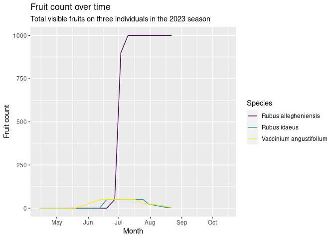

Project analysis
================
Rat Bastards

``` r
 # install.packages("devtools")
 # install.packages("suncalc")  #install these in the console
 # devtools::install_github("datastorm-open/suncalc")
# install.packages("visdat")
# install.packages("naniar")
# install.packages("gganimate")

library(gifski) # for animation
library(tidyverse) # basic
library(dplyr)
library(broom)
library(readr)
library(forcats) # redorder/rename
library(lubridate)
library(devtools)
library(visdat)
library(naniar)                                 
library(gganimate)
library(leaflet) ## For leaflet interactive maps
library(sf) ## For spatial data
library(htmltools) ## For html
library(leafsync) ## For placing plots side by side
library(kableExtra) ## Table output
library(stringr) ## String manipulation
library(rgeoboundaries) ## Administrative boundaries
library(sp)
```

``` r
# hurricane_plants <- read_csv("../data/hurricane_plants.csv")

hurricane_plants <- read_csv("../data/hurricane_plants.csv", 
    col_types = cols(date = col_date(format = "%m/%d/%Y")))

weather_data <- read_csv("../data/neracoos_buoy_data.csv")
```

``` r
# arrange variables in logical order
hurricane_plants <- relocate(hurricane_plants, 
       date, 
       life_form, 
       species, 
       common_name,
       # angiosperm data
       initial_emergence,
       breaking_leaf_buds_count,
       leaf_presence,
       percent_unfolded_leaves,
       unfolded_leaves_count,
       percent_full_size_leaf,
       percent_leaves_colorful,
       fallen_leaf_presence,
       buds_and_flowers_count,
       percent_open_flowers,
       pollen_amount,
       fruit_count,
       unripe_seed_cone_count, 
       percent_ripe_fruits,
       dropped_fruit_count,
       # pteridophyte data
       percent_stalk_growth,
       percent_fiddlehead_unrolled,
       sporangia_presence,
       releasing_spores,
       # gymnosperm data
       breaking_needle_bud_count,
       young_needle_count,
       percent_open_pollen_cones,
       pollen_cone_count,
       ripe_seed_cone_count,
       
       notes
       )

# remove empty rows, where life_form is NA 
hurricane_plants <- hurricane_plants %>% 
  filter(!is.na(life_form))
```

``` r
hurricane_plants %>%
  ggplot(aes(x = fct_infreq(common_name), fill = life_form)) +
  
  geom_bar() +
  coord_flip() +
  labs(title = "amount of observations by species") +
  xlab("") +
  ylab("") +
  scale_fill_viridis_d()
```


``` r
# show columns with color coded NAs and datatypes
visdat::vis_dat(hurricane_plants)
```

<!-- -->

``` r
# create lolipop graph of NAs by column
naniar::gg_miss_var(hurricane_plants)
```

<!-- -->

``` r
gg_miss_fct(hurricane_plants, fct = common_name)
```

<!-- -->

``` r
# first emergence column creation
hurricane_plants_join <- hurricane_plants %>%
  # mutate(date = as.Date(date)) %>%
  group_by(species, initial_emergence) %>% 
  filter(date == min(date)) %>% 
  slice(1) %>% # takes the first occurrence if there is a tie
  ungroup() %>%
  filter(initial_emergence == "TRUE") %>%
  dplyr::select(date, species, first_emergence=initial_emergence)

hurricane_plants <- hurricane_plants %>%
  full_join(hurricane_plants_join, join_by(date, species))
```

``` r
# create column with woody/herbaceous/fern/coniferous
hurricane_plants <- hurricane_plants %>%
  mutate(plant_type = case_when(
    common_name == "bull thistle" ~ "herbaceous",
    common_name == "cinnamon fern" ~ "fern",
    common_name == "red spruce" ~ "coniferous",
    life_form == "vine" ~ "herbaceous",
    life_form == "shrub" ~ "woody",
    life_form == "tree" ~ "woody",
    life_form == "herb" ~ "herbaceous",
    life_form == "vine" ~ "herbaceous",
    .default = "Other"
  ))
```

``` r
# create column with IcePond/MainCampus/MainGardenArea/MeadowGarden/SouthEnd&HighCliffs
hurricane_plants <- hurricane_plants %>%
  mutate(location = case_when(
    # main garden plants
    common_name == "apple" ~ "main garden area",
    common_name == "northern bayberry" ~ "main garden area",
    common_name == "garlic" ~ "main garden area",
    common_name == "horse chestnut" ~ "main garden area",
    common_name == "yarrow" ~ "main garden area",
    # south end/high cliffs plants
    common_name == "beach pea" ~ "south end & high cliffs",
    common_name == "blackberry" ~ "south end & high cliffs",
    common_name == "blueberry" ~ "south end & high cliffs",
    common_name == "Canada mayflower" ~ "south end & high cliffs",
    common_name == "sarsaparilla" ~ "south end & high cliffs",
    common_name == "starflower" ~ "south end & high cliffs",
    # main campus plants
    common_name == "beach rose" ~ "main campus",
    common_name == "American black elderberry" ~ "main campus",
    common_name == "peony" ~ "main campus",
    common_name == "raspberry" ~ "main campus",
    # meadow garden plants
    common_name == "bull thistle" ~ "meadow garden",
    common_name == "calendula" ~ "meadow garden",
    common_name == "foxglove" ~ "meadow garden",
    common_name == "mustard" ~ "meadow garden",
    common_name == "red elderberry" ~ "meadow garden",
    # ice pond plants
    common_name == "cinnamon fern" ~ "ice pond",
    common_name == "red spruce" ~ "ice pond",
    common_name == "water lily" ~ "ice pond",
    
    .default = "Other"
  ))
```

``` r
# create leafing out phenophase
hurricane_plants <- hurricane_plants %>%
  mutate(leaf_out = case_when(
    initial_emergence == T & buds_and_flowers_count == 0 & 
      common_name %in% c("yarrow", 
                         "water lily",
                         "mustard",
                         "foxglove",
                         "Canada mayflower",
                         "calendula",
                         "bull thistle",
                         "beach pea") ~ T,
     breaking_leaf_buds_count > 0 & percent_full_size_leaf < 1 & 
      common_name %in% c("red elderberry",
                         "raspberry",
                         "horse chestnut",
                         "northern bayberry") ~ T,
     breaking_leaf_buds_count > 0 & percent_unfolded_leaves < 1 & 
      common_name %in% c("blueberry",
                         "blackberry",
                         "American black elderberry",
                         "beach rose",
                         "apple") ~ T,
    unfolded_leaves_count > 0 & percent_full_size_leaf < 1 &
      common_name %in% c("garlic") ~ T,
     initial_emergence == T & percent_full_size_leaf < 1 & 
      common_name %in% c("peony") ~ T,
    initial_emergence == T & percent_fiddlehead_unrolled < 1 &
      common_name %in% c("cinnamon fern") ~ T,
    breaking_needle_bud_count > 0 ~ T,
    .default = F
  ))
  
# create budding phenophase
hurricane_plants <- hurricane_plants %>%
  mutate(budding = case_when(
    buds_and_flowers_count > 0 & percent_open_flowers < 1 &
     common_name %in% c("yarrow",
                        "water lily",
                        "starflower",
                        "raspberry",
                        "peony",
                        "mustard",
                        "horse chestnut",
                        "foxglove",
                        "Canada mayflower",
                        "calendula",
                        "American black elderberry",
                        "blackberry",
                        "beach rose",
                        "beach pea",
                        "northern bayberry",
                        "apple") ~ T,
    # sporangia_presence == T & releasing_spores == F &
    #   common_name %in% c("cinnamon fern") ~ T,
    buds_and_flowers_count > 0 & date < 2023-07-26 &
      common_name %in% c("bull thistle") ~ T,
    buds_and_flowers_count > 0 & date < 2023-06-14 &
      common_name %in% c("blueberry") ~ T,
    .default = F
  ))

# create flowering phenophase
hurricane_plants <- hurricane_plants %>%
  mutate(flowering = case_when(
    percent_open_flowers > 0 & !is.na(buds_and_flowers_count) &
      common_name %in% c("yarrow",
                         "starflower",
                         "red elderberry",
                         "peony",
                         "mustard",
                         "horse chestnut",
                         "foxglove",
                         "Canada mayflower",
                         "bull thistle",
                         "blueberry",
                         "American black elderberry",
                         "blackberry",
                         "beach rose",
                         "beach pea",
                         "northern bayberry",
                         "apple") ~ T,
    percent_open_flowers > 0 &
       common_name %in% c("water lily",
                          "calendula") ~ T,
    percent_open_flowers > 0 & buds_and_flowers_count > 0 &
       common_name %in% c("raspberry") ~ T,
    .default = F
  ))

# create fruiting phenophase
hurricane_plants <- hurricane_plants %>%
  mutate(fruiting = case_when(
    percent_ripe_fruits > 0 & !is.na(fruit_count) &
      common_name %in% c("yarrow",
                         "starflower",
                         "raspberry",
                         "peony",
                         "mustard",
                         "horse chestnut",
                         "foxglove",
                         "Canada mayflower",
                         "calendula",
                         "bull thistle",
                         "blueberry",
                         "American black elderberry",
                         "blackberry",
                         "beach rose",
                         "beach pea",
                         "apple") ~ T,
    # ripe_seed_cone_count > 0 ~ T,
    fruit_count > 0 & dropped_fruit_count < 10000 &
      common_name %in% c("red elderberry") ~ T,
    .default = F
  ))

# create dispersal phenophase
hurricane_plants <- hurricane_plants %>%
  mutate(dispersal = case_when(
        dropped_fruit_count > 0 &
      fruit_count > 0 &
      common_name %in% c("red elderberry",
                         "raspberry",
                         "mustard",
                         "horse chestnut",
                         "foxglove", 
                         "Canada mayflower", 
                         "calendula",
                         "bull thistle",
                         "blueberry",
                         "American black elderberry", 
                         "blackberry", 
                         "beach rose",
                         "beach pea",
                         "apple") ~ T,
    dropped_fruit_count > 0 &
      common_name %in% c("yarrow", "starflower", "peony") ~ T,
    
    # releasing_spores == T &
    #   common_name %in% c("cinnamon fern") ~ T,
    .default = F
  ))

# pivot longer
hurricane_plants_long <- hurricane_plants %>%
  pivot_longer(
    cols = c(leaf_out : dispersal), 
    names_to = "phenophase"
  ) %>%
  filter(value == "TRUE") %>%
  group_by(species, life_form, plant_type, phenophase, location) %>%
  summarize(start_date = min(date), 
            end_date = max(date))
```

    ## `summarise()` has grouped output by 'species', 'life_form', 'plant_type',
    ## 'phenophase'. You can override using the `.groups` argument.

``` r
# reformat phenophase labels
hurricane_plants_long <- hurricane_plants_long %>%
  mutate(phenophase = case_when(
    phenophase == "leaf_out"           ~ "leafing out",
    phenophase == "dispersal"          ~ "dispersing",
    TRUE                                           ~ phenophase
  ))
```

``` r
# plot of species phenophases facet by location
hurricane_plants_long %>%
ggplot() +
  geom_segment(aes(x = fct_rev(species),
                    y = start_date,
                    xend = fct_rev(species),
                 yend=end_date,
                color = fct_relevel(phenophase, c("leafing out",
                                                   "budding",
                                                   "flowering",
                                                   "fruiting",
                                                   "dispersing"))),
               linetype = "dashed",
               size = 1) +

  geom_point(aes(x = fct_rev(species),
                 y = start_date,
                 shape = fct_relevel(phenophase, c("leafing out",
                                                   "budding",
                                                   "flowering",
                                                   "fruiting",
                                                   "dispersing"))),
             color = "aquamarine3",
             size = 2) +

  geom_point(aes(x = fct_rev(species),
                 y = end_date,
                 shape = fct_relevel(phenophase, c("leafing out",
                                                   "budding",
                                                   "flowering",
                                                   "fruiting",
                                                   "dispersing"))),
             color = "firebrick3",
             size = 2) +
  #geom_line(y = min(date)) +
  coord_flip() +
    # facet_wrap(~ plant_type, ncol = 1, scale = "free_y", strip.position = "left") +
  facet_wrap(~ location, ncol = 1, scale = "free_y", strip.position = "left") +
  theme_minimal() +
  theme(axis.text.y = element_text(face = "italic", size = 10),
    legend.position = "bottom",) +
  labs(x = "",
       y = "",
       title = "phenophase date ranges by location",
       shape = "",
       color = "") +
    scale_color_viridis_d() 
```

<!-- -->

``` r
 ggsave("locational-phenophases.png", width = 8, height = 10)
```

``` r
# create breaking needle phenophase
hurricane_plants <- hurricane_plants %>%
  mutate(breaking_needles = case_when(
    breaking_needle_bud_count > 0 & species %in% c("Picea rubens") ~ T,
    .default = F
  ))

# create pollen release phenophase
hurricane_plants <- hurricane_plants %>%
  mutate(pollen_release = case_when(
    percent_open_pollen_cones > 0 & date < as.numeric(2023-07-26) & 
      species %in% c("Picea rubens") ~ T,
    .default = F
  ))

# create developing seed cone phenophase
hurricane_plants <- hurricane_plants %>%
  mutate(developing_cones = case_when(
    unripe_seed_cone_count > 0 & ripe_seed_cone_count == 0 & species %in% c("Picea rubens") ~ T,
    .default = F
  ))

# create ripe seed cone phennophase
hurricane_plants <- hurricane_plants %>%
  mutate(ripe_cones = case_when(
    ripe_seed_cone_count > 0 & species %in% c("Picea rubens") ~ T,
    .default = F
  ))

# create dispersal phenophase
hurricane_plants <- hurricane_plants %>%
  mutate(dropped_cones = case_when(
    dropped_fruit_count > 0 & species %in% c("Picea rubens") ~ T,
    .default = F
  ))

# create unrolling phenophase
hurricane_plants <- hurricane_plants %>%
  mutate(unrolling = case_when(
    initial_emergence == T & percent_fiddlehead_unrolled < 1 & 
      common_name %in% c("cinnamon fern") ~ T,
    .default = F
  ))

# create ripening sporangia phenophase
hurricane_plants <- hurricane_plants %>%
  mutate(unripe_spores = case_when(
    sporangia_presence == T & releasing_spores == F & 
      common_name %in% c("cinnamon fern") ~ T,
    .default = F
  ))

# create spore release phenophase
hurricane_plants <- hurricane_plants %>%
  mutate(sporing = case_when(
    releasing_spores == T &
      common_name %in% c("cinnamon fern") ~ T,
    .default = F
  ))

# create fall colors phenophase
hurricane_plants <- hurricane_plants %>%
  mutate(fall_colors = case_when(
    percent_leaves_colorful > 0 & 
      common_name %in% c("cinnamon fern") ~ T,
    .default = F
  ))

# pivot special
hurricane_long_special <- hurricane_plants %>%
  pivot_longer(
    cols = c(breaking_needles : fall_colors), 
    names_to = "special_phenophase"
  ) %>%
  filter(value == "TRUE") %>%
  group_by(species, life_form, special_phenophase) %>%
  summarize(start_date = min(date), 
            end_date = max(date))
```

    ## `summarise()` has grouped output by 'species', 'life_form'. You can override
    ## using the `.groups` argument.

``` r
# reformat special phenophase labels
hurricane_long_special <- hurricane_long_special %>%
  mutate(special_phenophase = case_when(
    special_phenophase == "breaking_needles"        ~ "breaking needle buds",
    special_phenophase == "pollen_release"          ~ "pollen release",
    special_phenophase == "developing_cones"        ~ "immature cones",
    special_phenophase == "ripe_cones"              ~ "mature cones",
    special_phenophase == "dropped_cones"           ~ "dispersing cones",
    special_phenophase == "unripe_spores"           ~ "sporangia emergence",
    special_phenophase == "unrolling"               ~ "fiddlehead unrolling",
    special_phenophase == "fall_colors"             ~ "leaves changing",
    TRUE                                            ~ special_phenophase
  ))

# plot spruce phenophases
hurricane_long_special %>%
  filter(species == "Picea rubens") %>%
ggplot() +
  geom_segment(aes(x = (fct_relevel(special_phenophase, 
                                    c("breaking needle buds",
                                      "pollen release",
                                      "immature cones",
                                      "mature cones",
                                      "dispersing cones"))),
                    xend = (fct_relevel(special_phenophase, 
                                        c("breaking needle buds",
                                      "pollen release",
                                      "immature cones",
                                      "mature cones",
                                      "dispersing cones"))),
                    y = start_date,
                    yend=end_date,
                color = special_phenophase),
                size = 1) +

  geom_point(aes(x = (fct_relevel(special_phenophase, c("breaking needle buds",
                                      "pollen release",
                                      "immature cones",
                                      "mature cones",
                                      "dispersing cones"))),
                      colour = "start date",
                 y = start_date),
             color = "aquamarine3",
             size = 1 ) +

  geom_point(aes(x = (fct_relevel(special_phenophase, c("breaking needle buds",
                                      "pollen release",
                                      "immature cones",
                                      "mature cones",
                                      "dispersing cones"))),
                 y = end_date,
                 colour = "end date"),
             color = "firebrick3",
             size = 1 ) +
  #geom_line(y = min(date)) +
  coord_flip()+
  #facet_wrap(~ species) +
  theme_minimal() +
  theme(legend.position = "bottom",
        plot.title = element_text(face = "italic")) +
  labs(x = "",
       y = "",
       title = "Picea rubens",
       color = "",
       colour = "") +
  scale_color_viridis_d()
```

<!-- -->

``` r
# ggsave("spruce-phenophases.png", width = 8, height = 6)

# plot fern phenophases
hurricane_long_special %>%
  filter(species == "Osmundastrum cinnamomeum") %>%
ggplot() +
  geom_segment(aes(x = (fct_relevel(special_phenophase, 
                                    c("fiddlehead unrolling",
                                      "sporangia emergence",
                                      "sporing",
                                      "leaves changing"))),
                    xend = (fct_relevel(special_phenophase, 
                                        c("fiddlehead unrolling",
                                      "sporangia emergence",
                                      "sporing",
                                      "leaves changing"))),
                    y = start_date,
                    yend=end_date,
                color = special_phenophase),
                size = 1) +

  geom_point(aes(x = (fct_relevel(special_phenophase, c("fiddlehead unrolling",
                                      "sporangia emergence",
                                      "sporing",
                                      "leaves changing"))),
                      colour = "start date",
                 y = start_date),
             color = "aquamarine3",
             size = 1 ) +

  geom_point(aes(x = (fct_relevel(special_phenophase, c("fiddlehead unrolling",
                                      "sporangia emergence",
                                      "sporing",
                                      "leaves changing"))),
                 y = end_date,
                 colour = "end date"),
             color = "firebrick3",
             size = 1 ) +
  #geom_line(y = min(date)) +
  coord_flip()+
  #facet_wrap(~ species) +
  theme_minimal() +
  theme(legend.position = "bottom",
        plot.title = element_text(face = "italic")) +
  labs(x = "",
       y = "",
       title = "Osmundastrum cinnamomeum",
       color = "",
       colour = "") +
  scale_color_viridis_d()
```

<!-- -->

``` r
ggsave("fern-phenophases.png", width = 8, height = 6)
```

``` r
hurricane_plants_long %>%
  ## filter(phenophase == "dispersing") %>%
ggplot() +
  geom_segment(aes(x = species,
                    y = start_date, 
                    xend = species,
                 yend=end_date, 
                color = life_form)) +
  
  geom_point(aes(x = species,
                 y = start_date), 
             color = "aquamarine3", 
             size = 1 ) +
  
  geom_point(aes(x = species,
                 y = end_date), 
             color = "firebrick3", 
             size = 1 ) +
  #geom_line(y = min(date)) +
  coord_flip()+
  facet_wrap(~ fct_relevel(phenophase, c("dispersing",
                                                   "fruiting",
                                                   "flowering",
                                                   "budding",
                                                   "leafing out")), 
             scales = "free_y", 
             ncol = 1, strip.position = "left") +
  theme_minimal() + 
  theme (legend.position = "bottom") +   
  labs(x = "",
       y = "date range",
       title = "phenophase date ranges by species",
       color = "life form") +
  scale_colour_viridis_d()
```


``` r
## ggsave("dispersing_timings.png", width = 8, height = 6)
```

``` r
# join first emergence to phenophase dataframe
#hurricane_plants <- hurricane_plants %>%
# full_join(hurricane_plants_join, join_by(species))

# plot
hurricane_plants_long %>%
ggplot() +
  geom_segment( aes(x = (fct_relevel(phenophase, c("leafing out",
                                                   "budding",
                                                   "flowering",
                                                   "fruiting",
                                                   "dispersing"))), 
                    xend = (fct_relevel(phenophase, c("leafing out",
                                                      "budding",
                                                      "flowering",
                                                      "fruiting",
                                                      "dispersing"))),
                    y = start_date, 
                    yend=end_date, 
                color = phenophase),
                size = 1) +
  
  geom_point(aes(x = (fct_relevel(phenophase, c("leafing out", 
                                                "budding", 
                                                "flowering", 
                                                "fruiting",
                                                "dispersing"))),
                      colour = "start date",
                 y = start_date), 
             color = "aquamarine3", 
             size = 1 ) +
  
  geom_point(aes(x = (fct_relevel(phenophase, c("leafing out", 
                                                "budding", 
                                                "flowering", 
                                                "fruiting",
                                                "dispersing"))),
                 y = end_date,
                 colour = "end date"), 
             color = "firebrick3", 
             size = 1 ) +
  #geom_line(y = min(date)) +
  coord_flip()+
  facet_wrap(~ species) +
  theme_minimal() +
  theme(legend.position = "bottom",) +
  labs(x = "phenophase",
       y = "date range",
       title = "phenophase date ranges by species",
       color = "phenophase",
       colour = "") +
  scale_color_viridis_d()
```

<!-- -->

``` r
#do breaking leaf buds, buds and flowers, fruit count, dropped fruit count. Just for apple, do it as line

hurricane_plants %>%
  filter(species %in% c("Malus sp.")) %>%
  ggplot(aes(x = date)) +
  geom_line(aes(y = breaking_leaf_buds_count, color = "green")) +
  geom_line(aes(y = buds_and_flowers_count, color = "pink"))+
  geom_line(aes(y = fruit_count, color = "blue"))+
  geom_line(aes(y = dropped_fruit_count, color = "orange"))
```

    ## Warning: Removed 12 rows containing missing values (`geom_line()`).

<!-- -->

``` r
#ask laurie how to make this good and normal
```

``` r
#comparisons with raspberry, blackberry, and blueberry

hurricane_plants %>%
  filter(species %in% c("Rubus allegheniensis", "Vaccinium angustifolium", "Rubus idaeus")) %>%
  filter(!is.na(percent_ripe_fruits)) %>%
  ggplot(aes(x = date, y = percent_ripe_fruits, color = species)) +
  geom_line() +
  labs(title = "Percent ripe fruit coverage over time",
       subtitle = "Coverage in three fruit-bearing individuals in the 2023 season",
       x = "Month",
       y = "Percent of ripe fruit",
       color = "Species") +
  scale_color_viridis_d()
```


``` r
#Fruit numbers throughout the season
hurricane_plants %>%
  filter(species %in% c("Rubus allegheniensis", "Vaccinium angustifolium", "Rubus idaeus")) %>%
  ggplot(aes(x = date, y = fruit_count, color = species)) +
  geom_line() +
  labs(title = "Fruit count over time",
       subtitle = "Total visible fruits on three individuals in the 2023 season",
       x = "Month",
       y = "Fruit count",
       color = "Species") +
  scale_color_viridis_d()
```

    ## Warning: Removed 7 rows containing missing values (`geom_line()`).



``` r
#note that the blackberry bush was apparently huge so would have way more fruits than the other two
```

``` r
# my_anim <- hurricane_plants_long %>%
# ggplot(aes(group = species)) +
#   geom_segment( aes(x = (fct_relevel(phenophase, c("leafing out",
#                                                    "budding",
#                                                    "flowering",
#                                                    "fruiting",
#                                                    "dispersing"))), 
#                     xend = (fct_relevel(phenophase, c("leafing out",
#                                                       "budding",
#                                                       "flowering",
#                                                       "fruiting",
#                                                       "dispersing"))),
#                     y = start_date, 
#                     yend=end_date, 
#                 color = phenophase)) +
#   
#   geom_point(aes(x = (fct_relevel(phenophase, c("leafing out", 
#                                                 "budding", 
#                                                 "flowering", 
#                                                 "fruiting",
#                                                 "dispersing"))),
#                  y = start_date), 
#              color = "aquamarine3", 
#              size = 1 ) +
#   
#   
#   geom_point(aes(x = (fct_relevel(phenophase, c("leafing out", 
#                                                 "budding", 
#                                                 "flowering", 
#                                                 "fruiting",
#                                                 "dispersing"))),
#                  y = end_date), 
#              color = "firebrick3", 
#              size = 1 ) +
#   coord_flip() +
#   theme_minimal() +
#   theme(legend.position = "none") +
#   labs(x = "phenophase",
#        y = "date range",
#        title = 'species: {closest_state}') +
#   transition_states(states = species) +
#   scale_color_viridis_d()
# 
# animate(my_anim, duration = 30, fps = 20, width = 900, height = 900, res = 200, renderer = gifski_renderer()) 

# anim_save(filename = "lollipop.gif")
```

``` r
# lubridate weather entries, calculate useful daily temperatures
weather_data <- weather_data %>%
  mutate(time = ymd_hms(time),
         month = month(time),
         day = day(time),
         date = as_date(round_date(time, unit = "day"))) %>%
  mutate(air_temperature = as.numeric(air_temperature)) %>%
  group_by(date) %>%
  summarize(daily_mean_temp = mean(air_temperature, na.rm = TRUE),
            daily_min_temp = min(air_temperature, na.rm = TRUE),
            daily_max_temp = max(air_temperature, na.rm = TRUE),
            daily_sd_temp = sd(air_temperature, na.rm = TRUE))

# glimpse weather data
glimpse(weather_data)
```

    ## Rows: 258
    ## Columns: 5
    ## $ date            <date> 2023-02-10, 2023-02-11, 2023-02-12, 2023-02-13, 2023-…
    ## $ daily_mean_temp <dbl> 4.3199174, 4.5143333, 2.1710903, 3.0611181, 1.5061042,…
    ## $ daily_min_temp  <dbl> 2.844, 0.231, -0.375, 1.288, -1.607, -1.525, 2.950, 4.…
    ## $ daily_max_temp  <dbl> 5.705, 7.941, 4.306, 4.293, 3.260, 4.890, 8.490, 10.52…
    ## $ daily_sd_temp   <dbl> 0.6105609, 1.8303061, 1.2549979, 0.7976728, 1.6090949,…

``` r
# set species minimums for temperatures and calculate total days above "frosts"
weather_data %>%
  group_by(date) %>%
  mutate(yarrow_temp_above = case_when(daily_mean_temp > 5 ~ 1, 
                                       TRUE ~ 0),
         apple_temp_above = case_when(daily_mean_temp > 12 ~ 1, 
                                       TRUE ~ 0)) %>% #find relevant temperatures, name by species, and join to hurricane_plants by this variable (dates after critical period)
  pivot_longer(cols = c(yarrow_temp_above, apple_temp_above), names_to = "species_germ", values_to = "germination_possible") %>%
  filter(germination_possible == 1) %>% #earliest non-frost or favourable germination date
  group_by(species_germ) %>%
  slice_min(date, n = 1)
```

    ## # A tibble: 2 × 7
    ## # Groups:   species_germ [2]
    ##   date       daily_mean_temp daily_min_temp daily_max_temp daily_sd_temp
    ##   <date>               <dbl>          <dbl>          <dbl>         <dbl>
    ## 1 2023-05-07           13.7            9.67          17.5          1.63 
    ## 2 2023-02-16            5.99           2.95           8.49         0.994
    ## # ℹ 2 more variables: species_germ <chr>, germination_possible <dbl>

``` r
# line plot daily mean temperature
ggplot(weather_data, aes(x=date, y=daily_mean_temp)) +
  geom_line() 
```

    ## Warning: Removed 1 row containing missing values (`geom_line()`).


``` r
# plot ribbon of daily temperature readings
weather_data %>%
  ggplot(aes(x = date)) +
    geom_ribbon(aes(y = daily_mean_temp, ymin = daily_min_temp, ymax = daily_max_temp), alpha = 0.3) +
    # geom_line(aes(y = daily_mean_temp), color = "blue") +
    geom_line(aes(y = daily_min_temp), color = "skyblue") +
    geom_line(aes(y = daily_max_temp), color = "violetred3") +
  labs(y = "daily temperature range (celcius)",
       title = "daily air temperatures of Hurricane Island") +
  geom_line(y = 0)
```


``` r
 ggsave("spring-to-oct-temperatures.png", width = 14, height = 8)
```

``` r
points_and_zones <- read_csv("../data/plantsandzones.csv")
# read points
plant_points <- read_csv("../data/hurricane_points.csv")
plant_zones <- read_csv("../data/hurricane_zones.csv")

#join plant points and points and zones
map_join <- plant_points %>%
  left_join(points_and_zones, by = "Plant")

#assign colors to zones for map
zone_color <- colorFactor(palette = c("#d7191c", "#fdae61", "#ffffbf", "#7b3294", "#2c7bb6"),
                          domain = c("Ice Pond", "Main Campus", "Main Garden Area", "Meadow Garden", "South End & High Cliffs"),
                          ordered = TRUE)
```

``` r
# read points
# plant_points <- read_csv("../data/hurricane_points.csv")
# plant_zones <- read_csv("../data/hurricane_zones.csv")

# create map
# leaflet(data = map_join) %>%
#    addTiles() %>%
#   addProviderTiles(providers$OpenStreetMap) %>%
#    setView(lng = -68.895, #<<
#            lat = 44.0348, #<<
#            zoom = 14.45) %>% #<<
#   addCircles(~x, ~y,
#         fillColor = ~zone_color(map_join$Zone),
#              stroke = TRUE,
#              weight = 1,
#              color = "black",
#              fillOpacity = 0.7,
#              radius = 10,
#         highlight = highlightOptions(
#              weight = 3,
#              color = "blue",
#              fillOpacity = 1,
#              bringToFront = TRUE
#         ),
#         label = ~Plant) %>%
#         addLegend(
#              position = "bottomright",
#              pal = zone_color,
#              values = ~map_join$Zone,
#              title = "Plant Locations by Zone",
#              opacity = 1
#         )%>%
#   addScaleBar()
```
