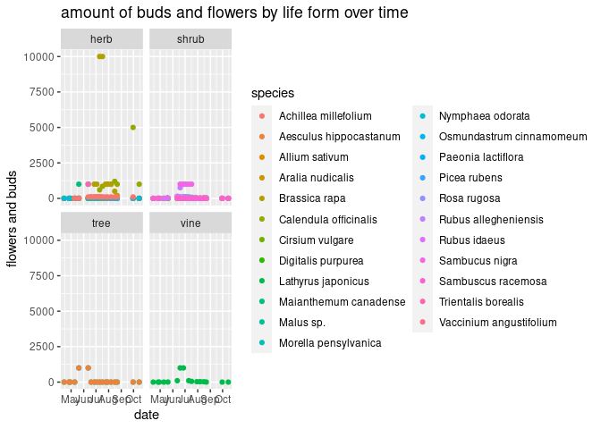
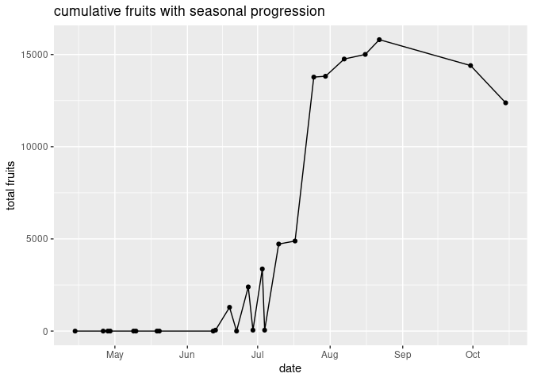

Project proposal
================
Rat Bastards

``` r
library(tidyverse)
library(broom)
```

## 1. Introduction

Our data are a collection of phenological observations on vegetation
from Hurricane Island. Phenology is the study of the changes in
development that biological organisms progress through with the seasons.
This includes phenomenona such as leafing out, budding, flowering,
fruiting, and leaves turning and falling. These phenomenona usually
occur sequentially depending on a variety of factors such as
precipitation and amount of days above a minimum temperature. Each plant
has different needs for development, and these needs are important to be
met so that their timings align with other phenomena such as pollinator
timing and seeds falling at the proper time for regeneration. This
dataset was gathered in the 2023 spring-fall field season to track the
phenophases of a broad range of plant species. The data were collected
by one of our team members who visited individual plants each week
throughout the season. Photos were taken of each plant on a weekly basis
to identify phenophase development. The phenophases tracked were based
on the categories described by the National Phenology Network. The
primary goal of this research is to create and visualize a baseline
phenological record of the vegetation on Hurricane Island which can be
used in future analysis. Additionally, we plan to analyze how the
phenophases develop in response to varying climatic factors throughout
the season. We also intend to visualize comparisons between differing
species categories such as fruit-bearing/non-fruit-bearing,
native/introduced, etc to see how their development varies. The cases
are each plant species and its disposition on the calendar day on which
it was observed. The variables are date of data collection, species
information, and phenological observations made. Individual species have
differing phenological observations made depending on varying
morphology. (Eg. A plant that fruits versus one that does not).

## 2. Data

``` r
library(readr)

hurricane_raw_data <- read_csv("../data/hurricane_plants.csv")
```

    ## New names:
    ## Rows: 1342 Columns: 27
    ## ── Column specification
    ## ──────────────────────────────────────────────────────── Delimiter: "," chr
    ## (6): date, life_form, species, notes, pollen_amount, ...21 dbl (18):
    ## breaking_leaf_buds_count, percent_unfolded_leaves, percent_full_si... lgl (3):
    ## fallen_leaf_presence, initial_emergence, leaf_presence
    ## ℹ Use `spec()` to retrieve the full column specification for this data. ℹ
    ## Specify the column types or set `show_col_types = FALSE` to quiet this message.
    ## • `...15` -> `...21`

``` r
# remove empty rows, where life_form is NA 
hurricane_raw_data <- hurricane_raw_data %>% 
  filter(!is.na(life_form))
# another option for the same function: drop_na(life_form)

# reorder variables to logical order
hurricane_plants <- relocate(hurricane_raw_data, 
       date, 
       life_form, 
       species, 
       initial_emergence,
       breaking_leaf_buds_count,
       leaf_presence,
       percent_unfolded_leaves,
       unfolded_leaves_count,
       percent_full_size_leaf,
       percent_leaves_colorful,
       fallen_leaf_presence,
       breaking_needle_bud_count,
       young_needle_count,
       percent_stalk_growth,
       percent_fiddlehead_unrolled,
       buds_and_flowers_count,
       percent_open_flowers,
       pollen_amount,
       pollen_cone_count,
       percent_open_pollen_cones,
       fruit_count,
       unripe_seed_cone_count, 
       percent_ripe_fruits,
       ripe_seed_cone_count,
       dropped_fruit_count,
       notes
       )

# write dataframe to CSV file
# write_csv(hurricane_plants, file = "hurricane_plants_clean.csv")

glimpse(hurricane_plants)
```

    ## Rows: 398
    ## Columns: 27
    ## $ date                        <chr> "4/14/2023", "4/26/2023", "4/29/2023", "5/…
    ## $ life_form                   <chr> "tree", "tree", "tree", "tree", "tree", "t…
    ## $ species                     <chr> "Malus sp.", "Malus sp.", "Malus sp.", "Ma…
    ## $ initial_emergence           <lgl> NA, NA, NA, NA, NA, NA, NA, NA, NA, NA, NA…
    ## $ breaking_leaf_buds_count    <dbl> 0, 10, 10, 1000, 10000, 10000, 10000, 1000…
    ## $ leaf_presence               <lgl> NA, NA, NA, NA, NA, NA, NA, NA, NA, NA, NA…
    ## $ percent_unfolded_leaves     <dbl> 0.00, 0.00, 0.00, 0.00, 0.75, 1.00, 1.00, …
    ## $ unfolded_leaves_count       <dbl> NA, NA, NA, NA, NA, NA, NA, NA, NA, NA, NA…
    ## $ percent_full_size_leaf      <dbl> 0.00, 0.00, 0.00, 0.00, 0.75, 1.00, 1.00, …
    ## $ percent_leaves_colorful     <dbl> 0.0, 0.0, 0.0, 0.0, 0.0, 0.0, 0.0, 0.0, 0.…
    ## $ fallen_leaf_presence        <lgl> FALSE, FALSE, FALSE, FALSE, FALSE, FALSE, …
    ## $ breaking_needle_bud_count   <dbl> NA, NA, NA, NA, NA, NA, NA, NA, NA, NA, NA…
    ## $ young_needle_count          <dbl> NA, NA, NA, NA, NA, NA, NA, NA, NA, NA, NA…
    ## $ percent_stalk_growth        <dbl> NA, NA, NA, NA, NA, NA, NA, NA, NA, NA, NA…
    ## $ percent_fiddlehead_unrolled <dbl> NA, NA, NA, NA, NA, NA, NA, NA, NA, NA, NA…
    ## $ buds_and_flowers_count      <dbl> 0, 0, 0, 0, 1000, 1000, 0, 0, 0, 0, 0, 0, …
    ## $ percent_open_flowers        <dbl> 0.00, 0.00, 0.00, 0.00, 0.05, 1.00, 0.00, …
    ## $ pollen_amount               <chr> NA, NA, NA, NA, NA, NA, NA, NA, NA, NA, NA…
    ## $ pollen_cone_count           <dbl> NA, NA, NA, NA, NA, NA, NA, NA, NA, NA, NA…
    ## $ percent_open_pollen_cones   <dbl> NA, NA, NA, NA, NA, NA, NA, NA, NA, NA, NA…
    ## $ fruit_count                 <dbl> 0, 0, 0, 0, 0, 0, 1000, 1000, 1000, 1000, …
    ## $ unripe_seed_cone_count      <dbl> NA, NA, NA, NA, NA, NA, NA, NA, NA, NA, NA…
    ## $ percent_ripe_fruits         <dbl> 0, 0, 0, 0, 0, 0, 0, 0, 0, 0, 0, 0, 0, 0, …
    ## $ ripe_seed_cone_count        <dbl> NA, NA, NA, NA, NA, NA, NA, NA, NA, NA, NA…
    ## $ dropped_fruit_count         <dbl> 0, 0, 0, 0, 0, 0, 0, 0, 0, 0, 0, 5, 25, 25…
    ## $ notes                       <chr> NA, NA, NA, "other apple trees, perhaps wi…
    ## $ ...21                       <chr> NA, NA, NA, NA, NA, NA, NA, NA, NA, NA, NA…

``` r
#install.packages("raster")
library(raster)
```

    ## Loading required package: sp

    ## The legacy packages maptools, rgdal, and rgeos, underpinning the sp package,
    ## which was just loaded, were retired in October 2023.
    ## Please refer to R-spatial evolution reports for details, especially
    ## https://r-spatial.org/r/2023/05/15/evolution4.html.
    ## It may be desirable to make the sf package available;
    ## package maintainers should consider adding sf to Suggests:.

    ## 
    ## Attaching package: 'raster'

    ## The following object is masked from 'package:dplyr':
    ## 
    ##     select

``` r
library(tidyverse)
# Note we may need to change to the geodata package
```

``` r
# load weather data from neracoos
weather_data <- read_csv("../data/neracoos_buoy_data.csv")
```

    ## Rows: 36852 Columns: 24
    ## ── Column specification ────────────────────────────────────────────────────────
    ## Delimiter: ","
    ## chr (15): station, time, mooring_site_desc, air_temperature, barometric_pres...
    ## dbl  (9): air_temperature_qc, barometric_pressure_qc, wind_gust_qc, wind_spe...
    ## 
    ## ℹ Use `spec()` to retrieve the full column specification for this data.
    ## ℹ Specify the column types or set `show_col_types = FALSE` to quiet this message.

## 3. Ethics review

Data was collected by hand by one of our group members in an noninvasive
way.

## 4. Data analysis plan

We will visualize date, breaking leaves/buds/needles, flowering, and
fruiting phenophases of comparable species. We will also visualize these
phenophases based on records of climatic variables from this field
season. The climatic variables will need to be sourced from the
Worldclim database. We plan on utilizing violin plots, lollipop plots,
ridge plots, as well as potential animations and maps.

``` r
distinct(hurricane_plants, species) #there are 24 individual species
```

    ## # A tibble: 23 × 1
    ##    species                
    ##    <chr>                  
    ##  1 Malus sp.              
    ##  2 Morella pensylvanica   
    ##  3 Lathyrus japonicus     
    ##  4 Rosa rugosa            
    ##  5 Rubus allegheniensis   
    ##  6 Sambucus nigra         
    ##  7 Vaccinium angustifolium
    ##  8 Cirsium vulgare        
    ##  9 Calendula officinalis  
    ## 10 Maianthemum canadense  
    ## # ℹ 13 more rows

``` r
hurricane_plants %>%
  group_by(species) %>%
  filter(!is.na(breaking_leaf_buds_count),
         !is.na(breaking_needle_bud_count)) %>%
  summarise(max_breaking_leaf = max(breaking_leaf_buds_count),
            max_breaking_needle = max(breaking_needle_bud_count)) #not returning breaking needle count for the red spruce. Something wrong with dataset?
```

    ## Warning: There were 2 warnings in `summarise()`.
    ## The first warning was:
    ## ℹ In argument: `max_breaking_leaf = max(breaking_leaf_buds_count)`.
    ## Caused by warning in `max()`:
    ## ! no non-missing arguments to max; returning -Inf
    ## ℹ Run `dplyr::last_dplyr_warnings()` to see the 1 remaining warning.

    ## # A tibble: 0 × 3
    ## # ℹ 3 variables: species <chr>, max_breaking_leaf <dbl>,
    ## #   max_breaking_needle <dbl>

``` r
hurricane_plants %>%
  group_by(life_form) %>%
  filter(initial_emergence == "present") %>%
  summarise(initial_emergence_date_min = min(date),
            initial_emergence_date_max = max(date))
```

    ## Warning: There were 2 warnings in `summarise()`.
    ## The first warning was:
    ## ℹ In argument: `initial_emergence_date_min = min(date)`.
    ## Caused by warning in `min()`:
    ## ! no non-missing arguments, returning NA
    ## ℹ Run `dplyr::last_dplyr_warnings()` to see the 1 remaining warning.

    ## # A tibble: 0 × 3
    ## # ℹ 3 variables: life_form <chr>, initial_emergence_date_min <chr>,
    ## #   initial_emergence_date_max <chr>

``` r
hurricane_plants %>%
  filter(life_form == "tree",
         breaking_leaf_buds_count > 0) %>%
  summarise(tree_initial_emergence_date_min = min(date),
            tree_initial_emergence_date_max = max(date))
```

    ## # A tibble: 1 × 2
    ##   tree_initial_emergence_date_min tree_initial_emergence_date_max
    ##   <chr>                           <chr>                          
    ## 1 10/15/2023                      9/30/2023

``` r
#breaking leaf buds is the equivalent to initial emergence for trees. Figure out how to combine them into the same table?
#Look into why initial emergence max is all the same date so late in the season/if we even need initial emergence max
```

``` r
# Calculate maximum breaking leaf buds
hurricane_plants %>%
  group_by(species) %>%
  filter(!is.na(breaking_leaf_buds_count)) %>%  #remove NA values
  summarise(max_leaves_breaking = max(breaking_leaf_buds_count)) 
```

    ## # A tibble: 9 × 2
    ##   species                 max_leaves_breaking
    ##   <chr>                                 <dbl>
    ## 1 Aesculus hippocastanum                10000
    ## 2 Malus sp.                             10000
    ## 3 Morella pensylvanica                   1000
    ## 4 Paeonia lactiflora                      100
    ## 5 Rosa rugosa                           10000
    ## 6 Rubus allegheniensis                  10000
    ## 7 Rubus idaeus                          10000
    ## 8 Sambucus nigra                         1000
    ## 9 Vaccinium angustifolium               10000

``` r
# Why are there only 9 observations?

hurricane_plants %>%
  group_by(life_form) %>%
  filter(!is.na(unfolded_leaves_count)) %>%
  summarise(average_unfolded_leaves = mean(unfolded_leaves_count)) 
```

    ## # A tibble: 2 × 2
    ##   life_form average_unfolded_leaves
    ##   <chr>                       <dbl>
    ## 1 herb                         10.2
    ## 2 shrub                       688.

``` r
# Graph the amount of buds or flowers of each plant? facet by life form?
hurricane_plants %>%
  mutate(date = mdy(date)) %>%
ggplot(mapping = 
         aes(x = date, y = buds_and_flowers_count, color = species)) +
  geom_point() +
  # geom_density() +
  facet_wrap(~ life_form)
```

    ## Warning: Removed 37 rows containing missing values (`geom_point()`).

<!-- -->

``` r
# Graph total fruits over time
hurricane_plants %>%
  mutate(date = mdy(date)) %>%
  group_by(date) %>%
  summarise(total_fruits = sum(fruit_count, na.rm = T)) %>%
  ggplot(aes(
    x = date,
    y = total_fruits)) +
 geom_point() +
  labs(x = "date",
       y = "total fruits") +
  geom_line()
```

<!-- -->
